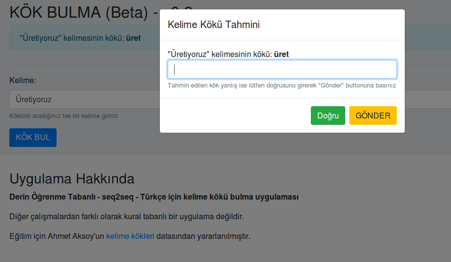

# Derin Öğrenme Tabanlı - seq2seq - Türkçe için kelime kökü bulma uygulaması (tr_stemmer)

Diğer çalışmalardan farklı olarak kural tabanlı bir uygulama değildir.

Eğitim için Ahmet Aksoy'un [Kalbur Projesi](https://github.com/ahmetax/kalbur)'nde yer alan [kelime kökleri](https://github.com/ahmetax/kalbur/blob/master/veri/KOKBULTEST.txt) verisinden yararlanılmıştır.

Önerilerinizi [Deep Learning Türkiye](http://deeplearningturkiye.com/) sosyal medya hesaplarımızdan veya deeplearningturkiye@gmail.com e-posta adresinden bizlere ulaştırabilirsiniz.

## Blog
Uygulama hakkında detaylı bilgiyi [blog yazımız](https://medium.com/deep-learning-turkiye/derin-%C3%B6%C4%9Frenme-tabanl%C4%B1-seq2seq-t%C3%BCrk%C3%A7e-kelime-k%C3%B6k-ay%C4%B1r%C4%B1c%C4%B1-5d3acc764c76)dan okuyabilirsiniz.

## Geliştiriciler
* [Yavuz Kömeçoğlu](https://github.com/yavuzKomecoglu)
* [Birol Kuyumcu](https://github.com/birolkuyumcu)

